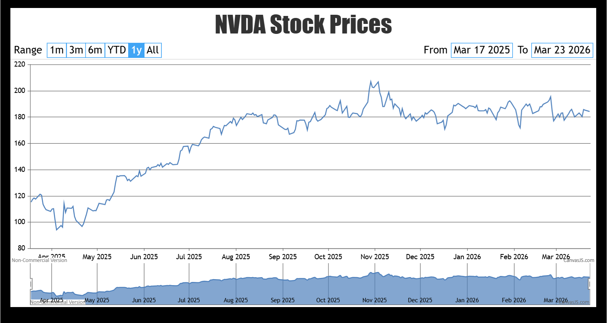
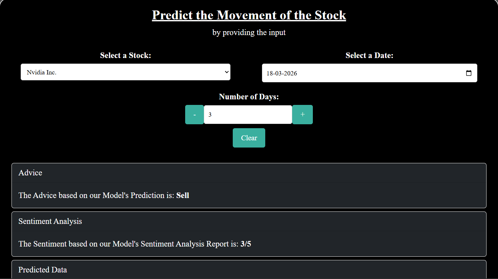
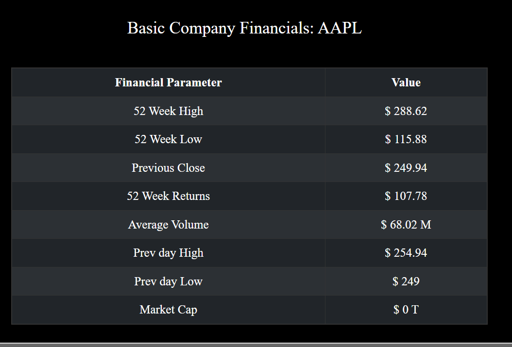

# SkyView Capital

SkyView Capital is an AI-powered stock prediction system that leverages LSTM neural networks, BERT-based sentiment analysis, and technical indicators to forecast stock price movements. It integrates machine learning with a full-stack web application to provide insights into market trends.

---

## Author

Priyansh Shukla
B.Tech CSE, Bennett University

---

## Features

* Stock price prediction using LSTM neural networks
* Market sentiment analysis using BERT model
* Technical analysis for trend prediction
* Full-stack application (React + Express + Flask)
* Integration of machine learning models with an interactive dashboard

---

## Tech Stack

* Frontend: React.js
* Backend: Node.js, Express.js
* Machine Learning: Python, Flask, LSTM, BERT

---

## Requirements

* Node.js
* Python 3.x
* Yarn (or npm)

---

## Installation & Setup

### 1. Clone the repository

```bash
git clone https://github.com/Priyanshshukla2005/SkyView-Capital.git
cd SkyView-Capital
```

---

### 2. Setup Frontend (Client)

```bash
cd Client
npm install
npm start
```

---

### 3. Setup Backend (Express)

```bash
cd Backend
yarn install
yarn start
```

---

### 4. Setup ML Model (Flask)

```bash
cd ML_Model
python -m venv venv
venv\Scripts\activate
pip install -r requirements.txt
python app.py
```

---

## 📸 Screenshots

### 📊 Stock Charts


### 🤖 Prediction


### 📈 Financial Data


## Project Structure

* Client → React frontend
* Backend → Express server
* ML_Model → Flask API with AI models

---

## Key Insight

This project demonstrates how combining deep learning models (LSTM), natural language processing (BERT), and technical indicators can enhance stock market prediction and provide more accurate insights into price movements.
